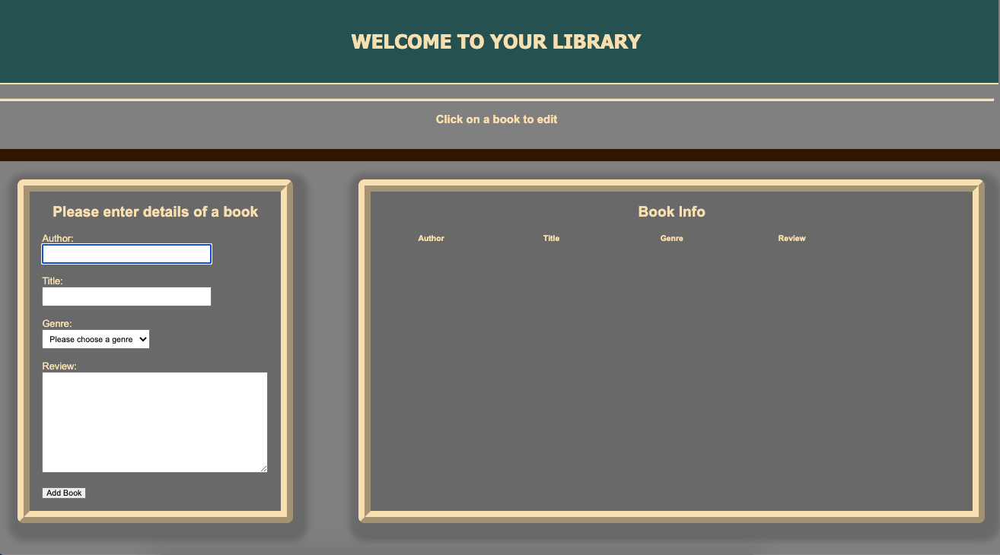
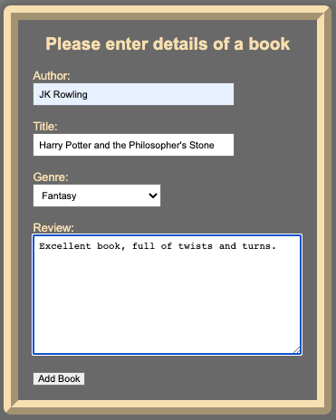
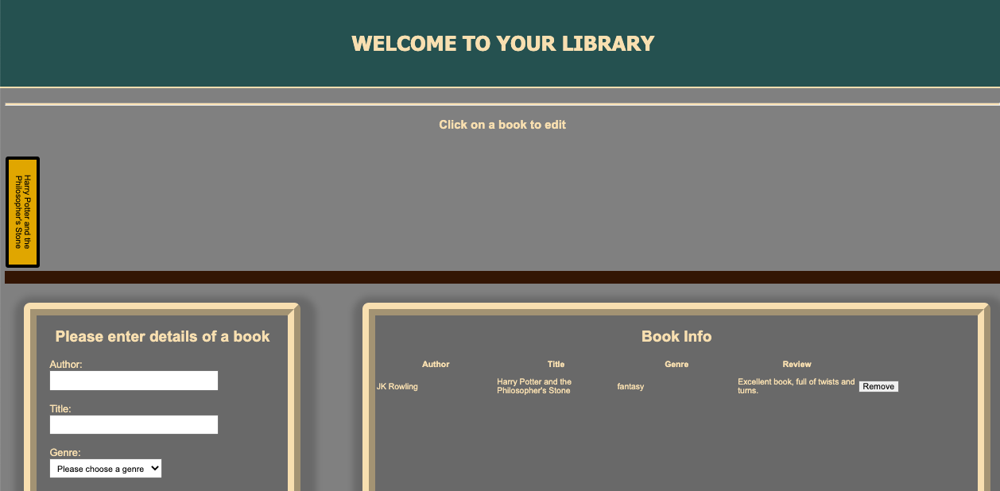
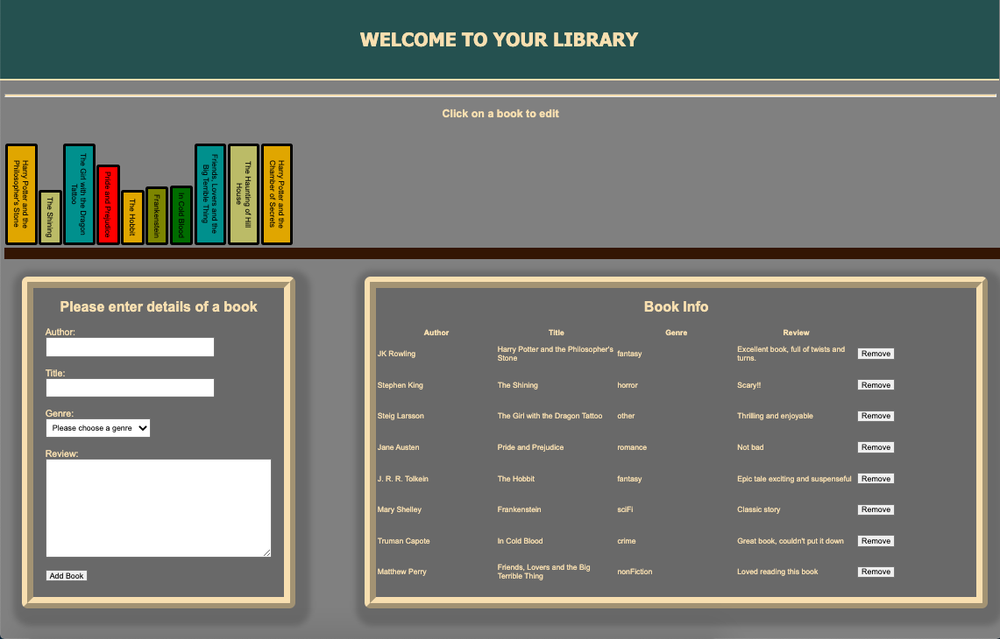
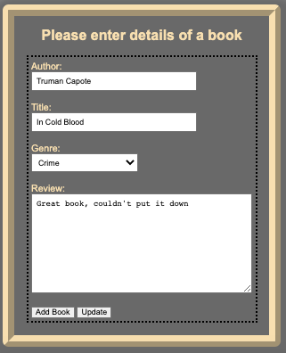

# Library
For this project I have created a library page that allows you to store a library of books you have read along with any reviews you wish to input. Once a book has been inputted it adds a book icon to your very own bookshelf and can be updated or removed at any time.

1. [Installation](#install)
2. [Usage](#usage)
3. [Credits](#credits)

## Installation
* Create a folder on your local drive
* Get to the directory in your terminal using cd
* Initialise the repository in your directory $ git init
* Clone the remote repository $ git clone https://github.com/SamBaldwin4566/library
* Open the index.html page as the opening page

## Usage
When you open the index.html you will have an empty library ready to be filled.  
  

To make a new entry will out the form as seen in teh screenshot.  
  

This will then populate the table and add your book to the bookshelf.  
  

Once you have created mulitple entries you will have a library that looks something like this;  
  

If you click on any book on the book shelf the entry form will repopulate with the book details and allow you to update the information on the book.  
  

## Credits
This was a individual project by Sam Baldwin